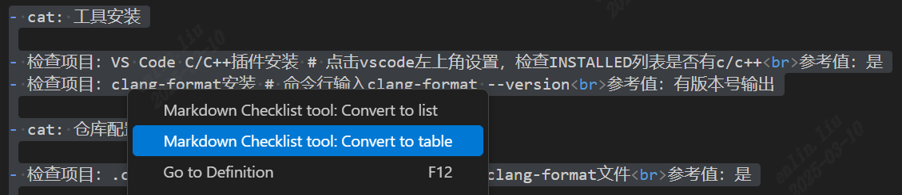
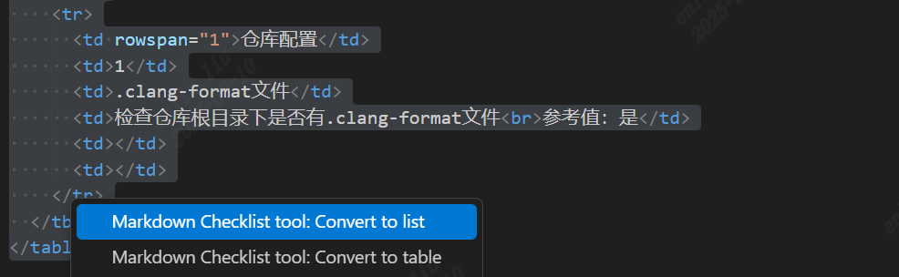

## 插件名称

Markdown与Html的table快速转换工具


## 功能特性

该工具支持将Markdown格式的文本内容转换成支持合并单元格的table表格，用于辅助撰写Checklist。Checklist表格特点如下：

- 表格表头为Cat、编号、Check项目、Check方法与参考值、Check结果、RP&TT
- 同一Cat下的Check项目，在Cat这列合并单元格
- 同一Cat下的Check项目，在编号这列，从1开始，依次递增

基本操作流程：

- 在Markdown文档中，使用原始的列表段落撰写Checklist
- 使用本插件将列表转换成table表格，并用markdown预览插件预览表格
- 表格符合要求后，删除列表内容，保留table表格
- 在后续的更新中，假如需要对Checklist进行修改，可使用本插件将table表格转换成列表，再进行修改

## 列表转table

- 使用如下规则撰写Checklist
- 使用一行 “-Cat:XXX” 新增一个Cat
- 在”-Cat:XXX”下方，新增具体的”Check项目“、”Check方法与参考值“,两者之间用#隔开（无需撰写编号、Check结果、RP&TT）

- 示例

```

-cat: 工具安装

- Check项目：VS Code C/C++插件安装 # Check方法与参考值：点击vscode左上角设置，检查INSTALLED列表是否有c/c++<br>参考值：是
- Check项目：clang-format安装 # Checks方法与参考值：命令行输入clang-format --version<br>参考值：有版本号输出

-Cat: 仓库配置

- Check项目：.clang-format文件 # Check方法与参考值：仓库根目录下是否有.clang-format文件<br>参考值：是

```

- 选中列表内容，右键“Markdown Checklist tool: Convert to table”，即可将列表转换成table表格。

## table转列表

- 选中table表格，右键“Markdown Checklist tool: Convert to list”，即可将table表格转换成列表
