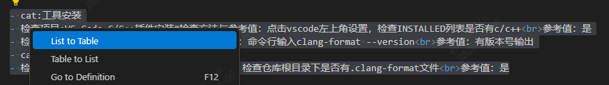
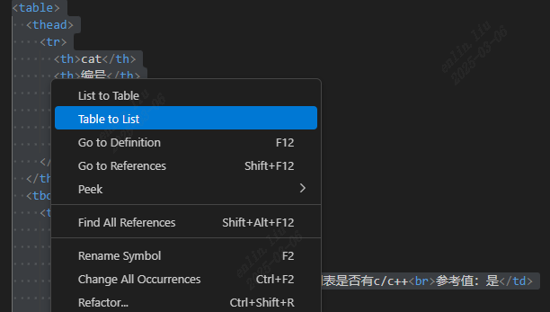

## 插件名称

Markdown与Html的table快速转换工具

## 功能特性
该工具支持将Markdown格式的文本内容转换成可以支持合并单元格的table表格，用于辅助撰写Checklist。

## Checklist 内容撰写格式


- Checklist的表头为Cat、编号、Check项目、Check方法与参考值、Check结果、RP&TT
- 撰写Markdown格式的Checklist时，需遵循如下规则
- Cat:XXX 表示某一类检查项的开始
- 在类声明下方，新增具体的Check项目和Check方法与参考值,两者之间用#隔开（无需撰写编号、Check结果、RP&TT）


- 示例如下

```
-Cat: 工具安装

- Check项目：VS Code C/C++插件安装 # Check方法与参考值：点击vscode左上角设置，检查INSTALLED列表是否有c/c++<br>参考值：是
- Check项目：clang-format安装 # Check方法与参考值：命令行输入clang-format --version<br>参考值：有版本号输出

-Cat: 仓库配置

- Check项目：.clang-format文件 # Check方法与参考值：仓库根目录下是否有.clang-format文件<br>参考值：是

```


## 使用方法
### 命令方式
1. 选中Markdown表格，右键点击List to Table实现HTML表格转换。

2. 选中HTML表格转换，右键点击Table to List实现Markdown表格。



